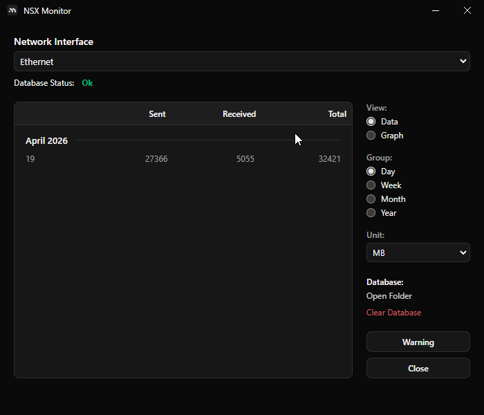
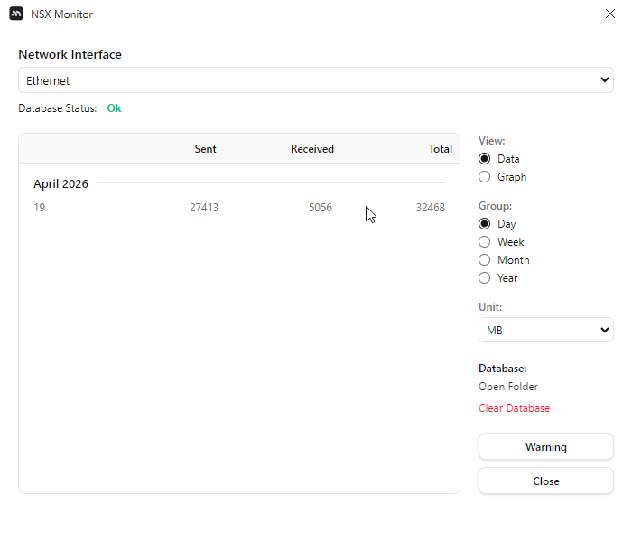
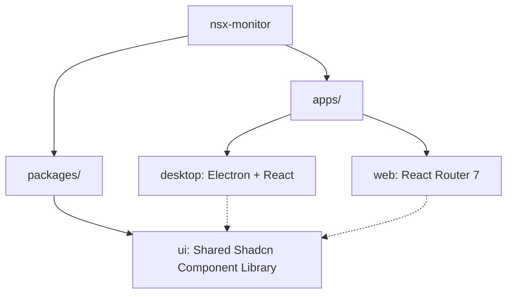

<div align="left">
  
  <h1>NSX Monitor</h1>
</div>


**NSX Monitor** is a professional-grade network telemetry suite designed for high-precision bandwidth monitoring and historical data analysis. It combines a powerful Electron-based desktop application with a sleek, interactive web landing page, all unified within a modern monorepo architecture.





---

## 🚀 Quick Start

Ensure you have [Node.js](https://nodejs.org/) (>=20) and [pnpm](https://pnpm.io/) installed.

1. **Clone the repository**
   ```bash
   git clone https://github.com/lwshakib/nsx-monitor.git
   cd nsx-monitor
   ```

2. **Install dependencies**
   ```bash
   pnpm install
   ```

3. **Run the development server**
   ```bash
   pnpm dev
   ```
   *This will start both the Desktop app and the Web landing page concurrently using Turborepo.*

---

## 🏗️ Architecture

The project is structured as a Turborepo monorepo, ensuring shared components and efficient builds.



### Main Components
- **`apps/desktop`**: A telemetry agent that gathers real-time network statistics and stores them in a local JSON database.
- **`apps/web`**: A React Router 7 landing page showcasing the product's capabilities and providing download links.
- **`packages/ui`**: A centralized library of 50+ high-quality React components powered by Tailwind CSS 4 and Radix UI.

---

## ⚙️ Configuration & Setup

### Environment Variables
The applications typically handle environment variables automatically through Vite. However, for custom configurations, you can create `.env` files:
- **Desktop**: Root variables for Electron build targets.
- **Web**: Server-side variables for React Router deployment.

### Development Commands
- `pnpm dev`: Start all applications in development mode.
- `pnpm build`: Build all applications for production.
- `pnpm format`: Run Prettier across the entire workspace.
- `pnpm typecheck`: Run TypeScript validation.

---

## 🤝 Contributing & Code of Conduct
Please refer to our [CONTRIBUTING.md](./CONTRIBUTING.md) for details on our code of conduct, and the process for submitting pull requests.

## 📄 License
This project is licensed under the MIT License - see the LICENSE file for details.
